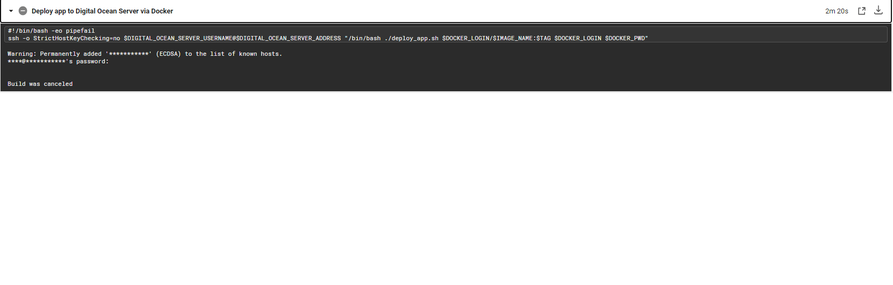

## Deployment guide

### Overview

These deployment instructions apply for most of our python and nodejs projects (If we are not using heroku). We currently have
the following deployment flow:

1. push project to github 
2. circleci triggered via .circleci config file
3. circleci automatically runs tests 
4. circleci automatically SSH into DO droplet and runs bash deployment script
6. bash script automatically pulls repo onto droplet
7. bash script automatically kills previous container, creates new tmux container and runs the specified file

Deployment workflow is adapted from this article: https://circleci.com/blog/build-cicd-piplines-using-docker/. 

Note that we should be dockerizing our python projects but are unable to currently do so due to @mrnewguy's computer that cannot
run Docker's windows containers. 

### Setting up of deployment workflow

As the 7 step workflow suggests, we need to set up the following items: 
- Github (no brainer)
- DigitalOcean droplet + bash script
- Circleci + config.yml file

See the sample_deployment_files folder for examples of those files. 


Detailed instructions for each of the items are as follows:

#### DigitalOcean droplet
##### If creating a DO droplet from scratch: 

1. Create new ubuntu 20.04 (LTS) x64 droplet. ($5/month plan will suffice.) 

2. Set SSH key (do not set password as circleci does not work with password).

3. Update the server and install pip: 

```
sudo apt update
sudo apt install python3-pip
```
Then, create a snapshot of the server for future use.

##### If base image already exists: 

Note that as of this current commit, we have a base image stored in DO.

1. Create a server from the base image.

2. SSH into the server and pull the repo.

3. The pulled repo should contain a deployment bash script. Run the following command to copy and paste the deployment script 
to the root folder ``cp <SCRIPT_NAME> ..``

#### Circleci
1. See the environment variables that are inside the config.yml file in the .circleci folder. Examples include the $PARENT_SCRAPER_1_SERVER_ADDRESS variable. 
 You will have to go to the circleci project settings to set those environment variables. 
 
2. The final command in the config.yml file is essentially asking circleci to ssh into the DO server and call the deploy_app.sh
script. To ssh in, you will first need to set the SSH keys in the circleci project settings.

#### How to deploy selenium on a remote server?
For selenium to work, the server needs a working version of a browser. The instructions here are for Google Chrome. 
Mozilla is another commonly used browser as well. 

Download google chrome into the Downloads folder.
```
wget -P ~/Downloads/ https://dl.google.com/linux/direct/google-chrome-stable_current_amd64.deb
``` 
Install google chrome. 
````
sudo dpkg -i ~/Downloads/google-chrome*.deb
````
If you run into errors while installing google chrome, install all the missing dependencies. Read [here](https://askubuntu.com/questions/220960/cannot-install-google-chrome-how-do-i-fix-it)
```
sudo apt-get install -f
```

Before downloading chromedriver, make sure that the version of chromedriver corresponds to the version of google chrome. 
To check the version of google chrome: 
```
google-chrome --version
```

Go to the [chromedriver site](https://chromedriver.chromium.org/downloads) to find the correct version of chromedriver. 
Download chromedriver.
```
wget -P ~/Downloads/ https://chromedriver.storage.googleapis.com/92.0.4515.43/chromedriver_linux64.zip
```

Unzip chromedriver.
```
unzip ~/Downloads/chromedriver_linux64.zip
```

Make chromedriver executable.
```
chmod +x ~/chromedriver
```

Move chromedriver to the /usr/local/share/ folder.
```
 sudo mv ~/chromedriver /usr/local/share/chromedriver
```

Add links to to the chromedriver (I think its the equivalent to adding to path on Windows)
```
sudo ln -s /usr/local/share/chromedriver /usr/local/bin/chromedriver
sudo ln -s /usr/local/share/chromedriver /usr/bin/chromedriver
```

However, using selenium without headless mode just like that will fail because it requires a "display". Hence, we need to install a 
virtual display driver. 

Install xfvb.

Set path in code to reference where chromedriver is.


## Tricky bits

Additional help for the trickiest bits if you are having problems.

##### 1. Deploying on digitalocean

Arguably the hardest part because there really is no automation here. We will have to write a bash script and push that
script onto the DO server.This bash script pulls the docker image and deploys it on the DO server. Here is the script in
its entirety.

```

set -e

DOCKER_IMAGE=$1
DOCKER_USERNAME=$2
DOCKER_PASSWORD=$3

CONAINER_NAME="db_microservice"

# Check for arguments
if [[ $# -lt 1 ]] ; then
	echo '[ERROR] You must supply a Docker Image to pull'
	exit 1
fi

echo "Deploying db_microservice to Docker Container"

#Check for running container & stop it before starting a new one
if [ $(docker inspect -f '{{.State.Running}}' $CONAINER_NAME) = "true" ]; then
	docker stop db_microservice
docker rm db_microservice
fi

echo "Starting db_microservice using Docker Image name: $DOCKER_IMAGE"
docker login -u $DOCKER_USERNAME -p $DOCKER_PASSWORD
docker pull mrnewguy/db_microservice:1.0
docker run --detach --publish 9000:9000  --name db_microservice $DOCKER_IMAGE

docker ps -a

```
To call this script, use the following command: `` /bin/bash ./deploy_app.sh $DOCKER_LOGIN/$IMAGE_NAME:$TAG $DOCKER_LOGIN $DOCKER_PWD``. 
Not that the capitalised words with money signs in front are actually environment variables, which brings me to......

Note that this deployment script might fail on linux if the line seperators are not set to LF (The default option on pycharm is CRLF so the script will likely throw an error.) Simply change the line separators to LF and save the file to fix this.

##### 2. Setting up CircleCI

Look, it honestly isnt too hard. There are just a bunch of things to set up and its a pain. The things include: 

- Setting up SSH access. In order to SSH into the DO server and deploy the bash script, we will need to run this command
in CircleCI's ``config.yml`` file: 
```
ssh -o StrictHostKeyChecking=no $DIGITAL_OCEAN_SERVER_USERNAME@$DIGITAL_OCEAN_SERVER_ADDRESS "/bin/bash ./deploy_app.sh $DOCKER_LOGIN/$IMAGE_NAME:$TAG $DOCKER_LOGIN $DOCKER_PWD"
```
- For the step above to be successful, we will need to add keys to CircleCI. Just follow the instructions here: https://circleci.com/docs/2.0/add-ssh-key/

A word of caution for the above - when creating a DO server in step 1, remember NOT TO ENABLE PASSWORD ACCESS. This is 
because CircleCI does not work with password access. We NEED to use SSH keys. Even if we do set up SSH keys after setting
up a password-accessible server, the following happens (the build gets stuck at this stage because it is waiting for a 
password to enter the server): 

